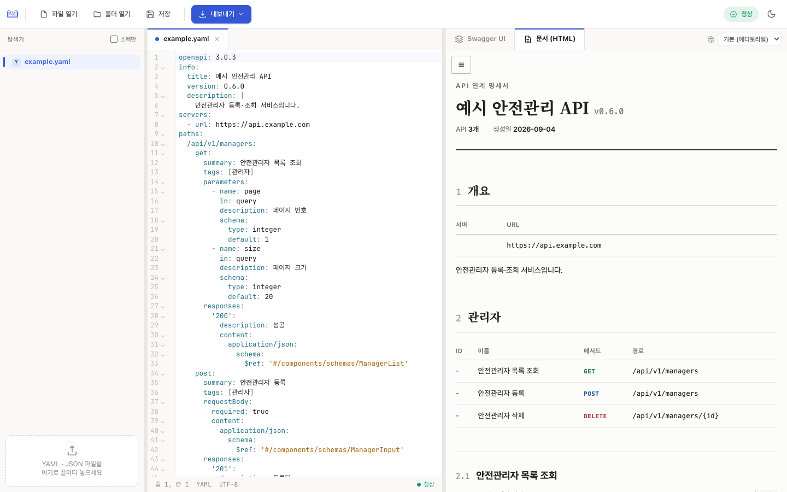
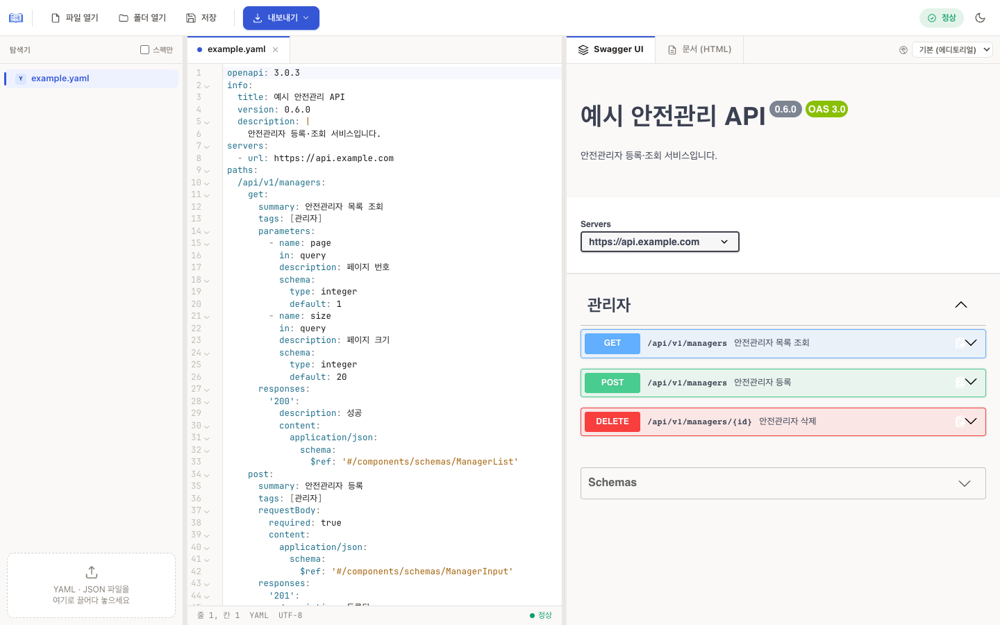
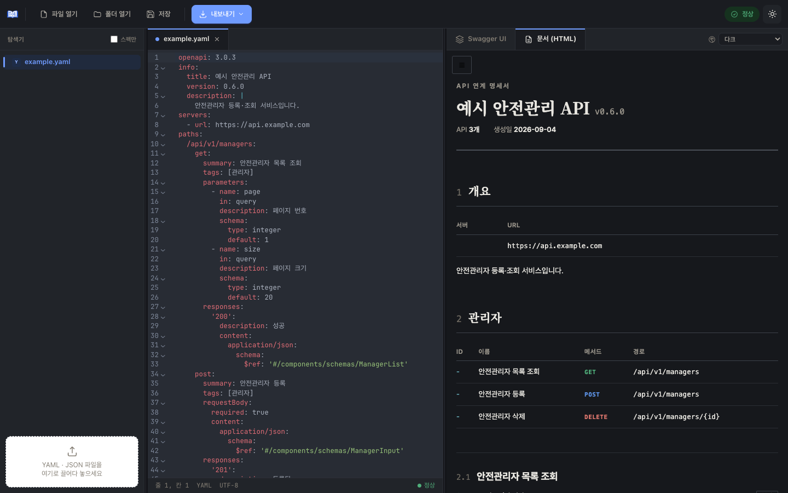

<p align="center">
  
</p>

<h1 align="center">API Specbook</h1>

<p align="center">
  OpenAPI(Swagger) 명세를 <b>열고 · 고치고 · 읽기 좋은 문서로 내보내는</b> 데스크톱 앱<br>
  <sub>Windows · macOS</sub>
</p>

<p align="center">
  <a href="https://github.com/iskim1018/api-specbook/releases/latest"></a>
  
  
</p>

---

API Specbook 은 OpenAPI 3.x YAML/JSON 파일을 다루는 사람 모두를 위한 도구입니다.
개발자는 에디터에서 명세를 고치며 바로 결과를 확인하고, 기획·연동 담당자·외부 기관처럼
Swagger UI 가 낯선 독자에게는 **표 중심의 단일 HTML 명세서**를 만들어 전달할 수 있습니다.

<p align="center">
  
</p>

## 주요 기능

- **실시간 미리보기** — 왼쪽에서 YAML/JSON 을 고치면 오른쪽 뷰어가 즉시 갱신됩니다. 문법 오류는 에디터에 인라인으로 표시됩니다.
- **두 가지 뷰어** — 익숙한 **Swagger UI** 와, 읽는 문서에 맞춘 **문서(HTML)** 탭을 전환하며 봅니다.
- **폴더 트리** — 폴더째 열어 여러 스펙을 오가며 편집합니다. 스펙 파일만 골라 보는 필터도 있습니다.
- **내보내기** — YAML · JSON · 단일 HTML 명세서(CSS/JS 인라인, 서버 없이 열림, 메일 첨부·인쇄/PDF 가능).
- **테마** — 앱 라이트/다크, 문서(HTML) 테마 3종(에디토리얼 · 다크 · 모던).
- **자동 업데이트** — 새 버전이 나오면 앱이 알려 줍니다.

<table>
  <tr>
    <td></td>
    <td></td>
  </tr>
  <tr>
    <td align="center"><sub>Swagger UI 탭</sub></td>
    <td align="center"><sub>다크 테마 (앱 + 문서)</sub></td>
  </tr>
</table>

## 설치

[Releases](https://github.com/iskim1018/api-specbook/releases/latest) 에서 운영체제에 맞는 설치 파일을 받습니다.

| OS | 파일 |
|---|---|
| macOS (Apple Silicon · Intel) | `.dmg` — 열고 `API Specbook.app` 을 Applications 로 끌어다 놓기 |
| Windows | `.msi` 또는 `.exe` |

설치 후에는 새 버전이 나오면 앱 시작 시 안내하므로 다시 내려받을 필요가 없습니다.

## 사용법

1. **파일 열기** 또는 **폴더 열기** — YAML/JSON 을 창에 끌어다 놓아도 됩니다. 처음 실행하면 샘플 명세가 열려 있습니다.
2. 가운데 에디터에서 편집합니다. 오른쪽 상단 상태 표시가 `정상` / `오류` 로 바뀝니다.
3. 오른쪽 뷰어에서 **Swagger UI** 와 **문서 (HTML)** 탭을 오가며 확인합니다. 문서 탭 옆의 드롭다운으로 테마를 고릅니다.
4. **저장** 으로 원본에 덮어쓰거나, **내보내기** 로 YAML · JSON · HTML 을 따로 저장합니다.

> 패널 사이 경계선을 끌어 탐색기·에디터·뷰어 너비를 조절할 수 있습니다.

## 문서(HTML) 명세서

"호출해 보는 도구"가 아니라 **"읽는 문서"** 입니다. Try it out 은 의도적으로 뺐습니다.

- **개요** — 제목, 버전, 서버 목록(변수 포함), `info.description` (Markdown 표·코드블록 렌더링)
- **인증** — `components.securitySchemes`
- **태그별 섹션** — 태그 내 API 목록 표 → 각 API 상세
- **API 상세** — operationId · 요약 · 메서드 + 경로(복사 버튼) · 설명 → 파라미터 표(Path/Query/Header/Cookie) → 요청 본문 표 + 예시 → 상태코드별 응답(2xx 펼침, 4xx/5xx 접힘)
- **좌측 목차** — 태그별 그룹, 검색 필터, 스크롤 위치 강조. 좁은 화면에서는 햄버거 버튼
- **인쇄** — 목차 숨김, 접힌 항목 모두 펼침

스키마는 깊이만큼 들여쓴 표로 평탄화됩니다. `$ref` 는 인라인으로 풀고, `allOf` 는 병합, `oneOf`/`anyOf` 는 "다음 중 하나" 아래 옵션 행으로, 순환 참조는 한 단계에서 끊어 표기합니다.

| 열 | 내용 |
|---|---|
| 항목 | 필드명. 부모 행의 ▾ 로 하위 접기 |
| 타입 | `string`, `array<object>`, `string (date)` 등. `nullable` 표시 |
| 필수 | 부모 스키마의 `required` 기준 |
| 제약 | maxLength, pattern, min/max, enum, default, format 등 |
| 설명 | `description` (Markdown) |
| 예시 | `example` |

확장 필드 중 `x-dsp-note` 는 "유의사항" 콜아웃, `x-dsp-rspns-paths` 는 "수신 경로" 표로 그리고, 그 외 `x-*` 는 접힌 "확장 필드" 로 남깁니다.

## CLI (oas2html)

앱과 같은 변환 엔진을 명령줄에서 씁니다. 여러 파일을 한 번에 HTML 로 만들 때 편리합니다.

```bash
npm install
node core/cli.mjs spec.yaml -o spec.html         # 단일 파일
node core/cli.mjs sample/*.y*ml -o dist/         # 여러 파일 → 디렉터리
```

## 제한

- OpenAPI 3.x 만 지원합니다. Swagger 2.0 은 변환 후 사용하세요.
- 외부 파일 `$ref` 는 지원하지 않습니다 (`#/components/...` 만).
- `discriminator` 는 특별히 처리하지 않습니다 (oneOf 로만 표현).
- 첫 번째 media type 만 표로 그리고 나머지는 이름만 표기합니다.

## 개발

```bash
npm install
npm run dev          # 프론트엔드만 브라우저에서 (Tauri 없이 UI 확인)
npm run app:dev      # Vite dev server + Tauri 창 (핫리로드)
npm run app:build    # 배포용 번들 (.app / .dmg / .msi …)
```

```
core/           공유 변환 엔진 (CLI · 앱 공용)
  cli.mjs         CLI 진입점
  model.mjs       OpenAPI → 렌더링 모델 ($ref 해소, allOf/oneOf, 스키마 평탄화)
  render.mjs      모델 → self-contained HTML
src/            데스크톱 앱 프론트엔드 (Vite)
  main.js         앱 셸 · 상태 · 툴바 · 미리보기 배선
  editor.js       CodeMirror 에디터 (YAML/JSON + 구문 검사)
  viewer.js       뷰어 (Swagger UI / 문서 HTML 탭)
  tree.js         폴더 트리
  fileio.js       파일 I/O (Tauri dialog/fs + 브라우저 폴백)
  parse.js        스펙 파싱 + 오류 위치
  updater.js      자동 업데이트
src-tauri/      Tauri(Rust) 셸 — 창, 플러그인, 권한
sample/         샘플 명세
docs/           문서 · 스크린샷
```

릴리스 절차와 CI 설정은 [docs/RELEASING.md](docs/RELEASING.md) 를 참고하세요.
